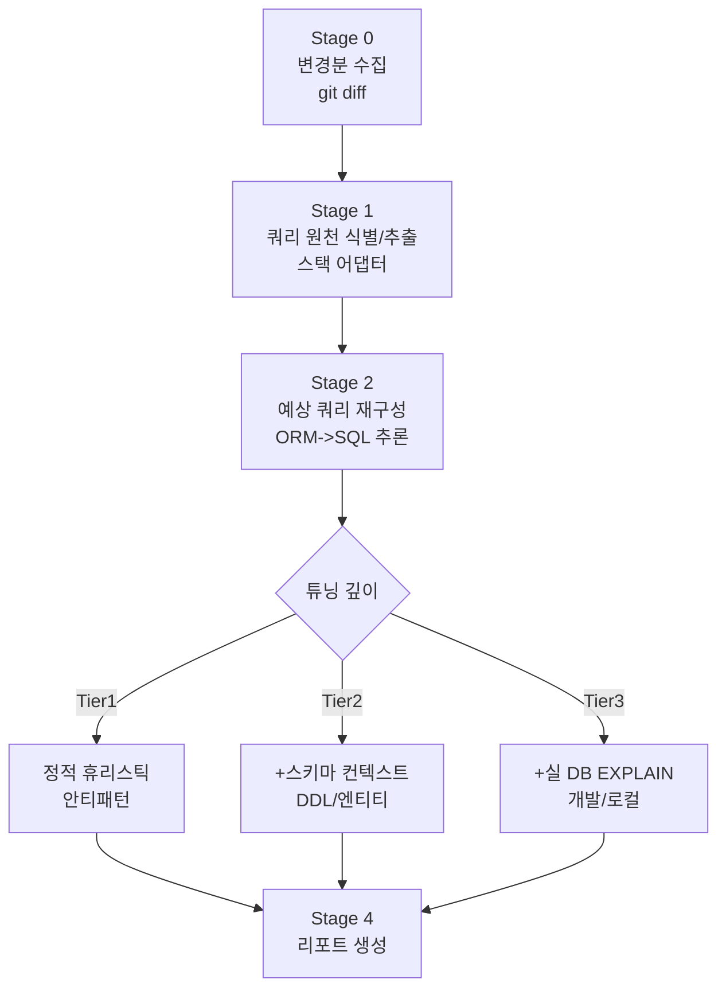

# query-inspector 설계안

> 변경분(diff)에서 SQL/ORM 쿼리를 추출해 커밋 전에 튜닝하고, 프로젝트 쿼리를 목록화하는 Claude Code 플러그인(`tuning-report`/`inventory-report` 두 스킬)
>
> - 버전: v1.0.0
> - 작성자: Yongho Hwang(황용호)

---

## 0. TL;DR

`code-review` 스킬의 **"쿼리 특화 + 변경분 한정"** 형제 스킬이다. 사용자가 커밋 직전(또는 원하는 시점)에 **수동으로 호출**하면:

1. staged diff(또는 지정 범위)에서 **쿼리를 생성하는 코드**만 선별하고,
2. 명시적 SQL은 그대로, **ORM 코드는 생성될 SQL을 추론**해 재구성한 뒤,
3. **3단계 깊이(정적 -> 스키마 컨텍스트 -> 실 DB EXPLAIN)** 로 튜닝 분석하고,
4. 위험도/근거/수정안이 담긴 **리포트**를 생성한다.

DB 접속 정보를 제공하면 개발/로컬 DB에 직접 `EXPLAIN`을 실행해 실측 기반 튜닝까지 수행한다(옵션, 가드레일 포함). 1차 지원 스택은 JPA/Hibernate/MyBatis/네이티브 SQL이며, 추출 로직은 **스택별 어댑터**로 분리해 Python/Node 등은 나중에 어댑터만 추가하면 되도록 설계한다.

---

## 1. 배경과 차별점

### 1.1 기존 도구 조사 결론

쿼리 튜닝 도구는 많지만, 트리거/입력 방식이 이 아이디어와 다르다.

| 유형 | 대표 사례 | 방식 | 한계(이 스킬 대비) |
|------|-----------|------|--------------------|
| 쿼리 최적화 스킬 | `sql-query-optimizer`, `sql-optimization`, `query-optimizer`, `database-optimizer` | 사람이 slow query + EXPLAIN을 **직접 붙여넣기** | 입력 수동, 변경분 자동 추출 없음 |
| 커밋 시점 SQL 검사 | Red-gate SQL Code Analysis(pre-commit) | **원시 SQL 파일** 정적 검사 | ORM이 *생성할* 쿼리는 못 봄 |
| ORM 쿼리 분석 | pganalyze, sqlcommenter, Hibernate Statistics | **런타임/테스트 실행 쿼리** 캡처 | 정적 diff 기반이 아님, 실행 전제 |

**틈새:** "(1) 커밋 시점(수동) + (2) 변경분 한정 + (3) 코드가 생성할 쿼리 정적 추출 + (4) 튜닝(+실 DB 옵션)"을 한 번에 묶은 완성품은 확인되지 않았다. 조각들은 다 존재하므로 **조합의 틈새**이며, 만들 명분이 있다.

### 1.2 가치 제안

- **인덱스 누락을 커밋 전에 검출한다 (주된 동기).** "쿼리를 만들고 인덱스 없이 배포"해 반복되는 성능 사고가 이 스킬의 출발점이다. `missing_index`가 대표 기능이며, 스키마가 있으면 구체적 `CREATE INDEX`(컬럼 순서/트레이드오프 포함)를 제안한다. 특히 같은 변경분의 마이그레이션과 교차해 "이번 배포에 필요한 인덱스가 빠졌다"를 짚는다.
- **범위를 변경분으로 좁힌다** -> 리뷰가 빠르고 저비용. (기존 `code-review`와 동일 철학)
- **ORM 코드를 SQL 관점으로 번역**한다 -> 개발자가 놓치던 N+1/인덱스 미스를 커밋 전에 검출한다.
- **DB가 있으면 진짜 튜닝, 없으면 정적 리뷰** -> 환경에 따라 자연스럽게 깊이 조절(graceful degradation).

---

## 2. 목표와 비목표 (Scope)

### 2.1 목표 (In Scope)

- 커밋 대상/지정 범위의 diff에서 쿼리 생성 코드 식별/추출.
- 명시적 SQL(문자열, MyBatis XML, 마이그레이션)과 ORM(JPA/Hibernate) 쿼리 **모두** 처리.
- 3단계 튜닝 깊이 지원, 환경에 따라 자동 선택/수동 지정.
- 실 DB `EXPLAIN` 기반 심화 분석(옵션, 안전장치 필수).
- 스택별 어댑터 구조로 확장성 확보.
- 스킬 표준 구조로 패키징(개인 글로벌/프로젝트 로컬 설치).

### 2.2 비목표 (Out of Scope, 최소 v1 기준)

- **커밋 훅 완전 자동화**(방해/비용 이유로 제외; 훅은 "보조 트리거"로만 선택 제공 - [5.5](#55-git-연동수동-호출-우선) 참조).
- **런타임 프로파일링**(실제 트래픽 기준 slow log 분석은 별도 영역).
- **자동 코드 수정 커밋**(수정안은 *제안*까지; 적용은 사용자 확인 후 별도).
- **프로덕션 DB 대상 실행**(원천 차단; [7. DB 안전장치](#7-db-접속-안전장치가드레일)).
- ORM 최종 SQL의 **100% 정확 재구성**(동적 쿼리는 근사/다중 시나리오로 다룸 - [6.4](#64-정확도-한계와-표기-규칙)).

---

## 3. 사용 시나리오 (UX)

### 3.1 기본 흐름 (수동 호출)

```
$ git add .
$ claude
> /query-inspector:tuning-report
```

또는 인자로 범위/옵션 지정:

```
> /query-inspector:tuning-report                     # staged 변경분 (기본)
> /query-inspector:tuning-report --range HEAD~3      # 최근 3커밋
> /query-inspector:tuning-report --range main..HEAD  # 브랜치 diff
> /query-inspector:tuning-report --files src/.../XxxRepository.kt
> /query-inspector:tuning-report --db dev            # 설정의 dev 프로파일로 EXPLAIN 심화
> /query-inspector:tuning-report --depth static      # 깊이 강제(static|schema|explain)
```

또는 튜닝 대신 프로젝트 쿼리를 목록화하는 형제 스킬:

```
> /query-inspector:inventory-report                  # 프로젝트 쿼리 목록(ORM 생성 포함, 기본 전체)
```

### 3.2 산출물

- 터미널 요약(위험도순 상위 N개).
- 상세 리포트 파일: `docs/query-inspector/tuning-reports/<timestamp>.md` (캐시/이력 겸용, `analyze-code` 스킬의 캐시 패턴 차용).
- 심각 이슈 발견 시 종료 코드/경고(훅/CI 연동을 위한 선택적 신호).

---

## 4. 아키텍처 개요



파이프라인 각 단계는 **독립 모듈**로, 어댑터/깊이는 플러그형이다. Claude Code 스킬 구현상으로는 SKILL.md의 절차 + `scripts/`의 보조 스크립트(diff 파싱, DB EXPLAIN 실행 등) + `references/`의 스택별 추출 규칙으로 나눈다([10. 디렉토리 구조](#10-디렉토리-구조)).

---

## 5. 단계별 상세

### 5.1 Stage 0 - 변경분 수집

- 입력 범위 결정: staged(기본) / `--range` / `--files`.
- `git diff --unified` + 변경 파일 전체 컨텍스트(diff만으로는 ORM 메서드 시그니처/엔티티 매핑을 못 보므로, 관련 파일은 필요 시 전체를 읽는다).
- 파일 유형 1차 분류: 소스코드 / MyBatis XML / 마이그레이션 SQL / 설정.
- 쿼리와 무관한 변경은 조기 제외(비용 절감).

### 5.2 Stage 1 - 쿼리 원천 식별/추출 (스택 어댑터)

변경 파일을 스택 어댑터로 라우팅하여 "쿼리를 생성하는 지점"을 추출한다. 어댑터는 `references/adapters/<stack>.md` 규칙 + 필요 시 `scripts/extract_<stack>.*`로 구성.

지원 매트릭스(1차):

| 어댑터 | 대상 | 추출 난이도 | 추출 산출물 |
|--------|------|-------------|-------------|
| `jpa` | JPA/Hibernate: `@Query`(JPQL/native), 파생 메서드명, `@EntityGraph`, QueryDSL, Criteria, `fetch` 전략 | 중~상 | 쿼리 의도 + 예상 SQL(들) + 페치/조인 메타 |
| `mybatis` | MyBatis XML `<select|insert|update|delete>`, 동적 `<if><foreach>` | 하(가장 쉬움) | 거의 원본 SQL + 동적 분기 시나리오 |
| `native-sql` | 코드 내 SQL 문자열, JdbcTemplate, `@Query(nativeQuery=true)` | 하 | 원본 SQL |
| `migration` | Flyway/Liquibase DDL/DML | 하 | DDL(인덱스/제약 변화 추적에 사용) |
| `python-django` | Django ORM(QuerySet/모델/`migrations/*.py`) - 확장/미검증 | 중 | 예상 SQL + 관계 로딩(select_related 등) 메타 |
| `python-sqlalchemy` | SQLAlchemy ORM/Core(`session.query`/`select`/모델/Alembic) - 확장/미검증 | 중 | 예상 SQL + 로딩 전략(joinedload 등) 메타 |

> 마이그레이션 어댑터는 **튜닝 대상이자 스키마 컨텍스트 소스**라는 이중 역할(인덱스가 새로 생겼는지 등).

### 5.3 Stage 2 - 예상 쿼리 재구성 (ORM -> SQL)

ORM 코드에서 **생성될 SQL의 형태**를 추론한다. LLM이 규칙/파서보다 잘하는 단계.

- JPA 파생 메서드(`findByAAndBOrderByC`) -> `SELECT ... WHERE a=? AND b=? ORDER BY c` 형태로 번역.
- 연관관계 `FetchType`/`@EntityGraph`/`join fetch`를 반영해 **N+1 발생 여부/조인 형태**를 판정.
- 동적 쿼리(QueryDSL/Criteria/`<if>`)는 **대표 시나리오 2~3개**로 분기 재구성(전체 경우의 수 X).
- SQL 방언(dialect)은 설정에서 지정(`mysql`/`postgresql`/`oracle`...). 미지정 시 ANSI 기준 + 방언 무관 패턴만.

산출물은 "**추론된 SQL(신뢰도 라벨 포함)** + 근거(어느 코드에서 왔는지)".

### 5.4 Stage 3 - 튜닝 분석 (3단계 깊이 -> [6장](#6-튜닝-깊이-3-tier))

### 5.5 Git 연동(수동 호출 우선)

- **기본은 수동 호출 스킬**. 커밋 흐름을 막지 않는다.
- 선택적 보조: `prepare-commit-msg`/`pre-commit` 훅은 "쿼리 관련 변경이 있으니 `/query-inspector:tuning-report`를 실행해 보세요" **알림만**(LLM 자동 호출 X). opt-in.
- 완전 자동은 **PR/CI 단계** 레시피로 별도 제공(문서화만, v1 이후).

---

## 6. 튜닝 깊이 3-tier

깊이는 자동 감지(가능한 가장 깊은 단계) 또는 `--depth`로 강제. 각 단계는 하위 단계를 포함한다.

### 6.1 Tier 1 - 정적 휴리스틱 (DB 불필요, 항상 동작)

스키마 없이 코드/쿼리만으로 잡는 안티패턴:

- **N+1** (반복문 내 지연로딩, fetch 누락).
- `SELECT *` / 과다 컬럼.
- WHERE 컬럼을 **함수로 감싸 인덱스 무력화**(`WHERE DATE(col)=...`), 암시적 타입 변환.
- 선행 와일드카드 `LIKE '%...%'`.
- **페이징 없는 대량 조회**, 미제한 `IN (...)` 대량 바인딩.
- 불필요한 `DISTINCT`/서브쿼리, 카티전 곱 위험.
- 트랜잭션 경계/락 범위 과다(가능한 범위에서).

### 6.2 Tier 2 - 스키마 컨텍스트 (DDL/엔티티 제공, 실행 없음)

엔티티 매핑/DDL/마이그레이션을 컨텍스트로 읽어 정밀도 상승:

- WHERE/JOIN/ORDER BY 컬럼에 **인덱스 존재 여부** 대조 -> 구체적 인덱스 제안(단일/복합, 컬럼 순서).
- 조인 키 타입 불일치, 누락된 FK 인덱스.
- 마이그레이션 diff와 대조해 "이번 변경으로 필요한 인덱스가 빠졌다" 탐지.
- 스키마 소스: **`--db` 실 DB 라이브 조회(`SHOW INDEX`/`information_schema` - 최우선/최정확, 읽기 전용)**, `--schema <path>`(DDL), 엔티티 클래스, `migration` 어댑터가 수집한 DDL 중 택1/복수. -> **`--db`만 제공하면 Tier2(스키마 대조)와 Tier3(EXPLAIN)가 함께 충족**되며, DDL/엔티티 별도 제공이 불필요하다. 배포 후 상태 = 실 DB 라이브 스키마(현재) + 이번 변경분 마이그레이션(델타).

### 6.3 Tier 3 - 실 DB EXPLAIN (개발/로컬 DB, 옵션)

DB 접속 정보 제공 시 실제 실행계획 기반 튜닝:

- 재구성된 SQL을 **`EXPLAIN`(비실행)** 으로 계획 수집 -> 풀스캔/인덱스 미사용/조인 순서/예상 rows 분석.
- 바인드 파라미터는 샘플/대표값 주입(설정 또는 추론).
- 원하면 `EXPLAIN ANALYZE`(실제 실행)까지 - **명시적 opt-in + 트랜잭션 롤백 + 읽기 전용 한정**([7장](#7-db-접속-안전장치가드레일)).
- 인덱스 제안을 가상으로 반영해 before/after 계획 비교(예: PostgreSQL `hypopg` 있으면 활용, 없으면 제안만).

> **깊이 자동 강등:** Tier 3 요청이나 DB 접속 실패/권한 부족 시 Tier 2로, 스키마 없으면 Tier 1로 자동 강등하고 리포트에 명시.

### 6.4 정확도 한계와 표기 규칙

ORM 동적 쿼리는 100% 재구성 불가. 그래서 모든 추론 쿼리에 **신뢰도 라벨**을 붙인다:

- `EXACT` - 명시적 SQL/MyBatis 정적 부분.
- `INFERRED` - ORM에서 재구성(대표 시나리오).
- `AMBIGUOUS` - 동적 분기가 많아 다중 시나리오/불확실.

리포트는 라벨별로 신뢰 수준과 "검증 방법(예: 로그로 실제 SQL 확인)"을 함께 안내한다. **과신 방지**가 배포 신뢰성의 관건.

---

## 7. DB 접속 안전장치(가드레일)

실 DB 직접 접근은 유용하지만 위험하다. 배포 제품이므로 **가드레일을 설계의 최우선 요소**로 둔다.

1. **프로덕션 차단(기본).** 호스트 allowlist/denylist, 이름 패턴(`*prod*` 등) 차단. 명시 허용 없이는 접속 불가.
2. **읽기 전용 원칙.** 읽기 전용 계정 사용을 문서로 강제 권장. 스킬은 `SELECT`/`EXPLAIN` 외 실행 금지.
3. **비실행 우선.** 기본은 `EXPLAIN`(계획만). 실제 실행(`EXPLAIN ANALYZE`)은 별도 플래그 + 확인 프롬프트 + **트랜잭션 열고 무조건 롤백**.
4. **DML/DDL 대상 제외.** diff의 `INSERT/UPDATE/DELETE/DDL`은 실행하지 않고 정적/스키마 분석만.
5. **타임아웃/리소스 제한.** statement timeout, row/시간 상한.
6. **자격증명 분리.** 접속정보는 스킬 밖(환경변수/`~/.config` 또는 프로젝트 `.env`), **저장소 커밋 금지**. 설정 파일에는 참조만.
7. **감사 로그.** 어떤 쿼리를 어느 DB에 던졌는지 리포트에 기록.
8. **명시적 opt-in.** DB 사용은 항상 사용자가 `--db`/설정으로 켤 때만. 기본은 정적.

---

## 8. 설정 스키마 (`.query-inspector.yml`, 프로젝트 루트)

```yaml
version: 1
stacks: [jpa, mybatis, native-sql, migration]   # 활성 어댑터
dialect: mysql                                    # mysql|postgresql|oracle|ansi
schema:
  ddl: [db/schema.sql]                            # Tier2 스키마 소스
  entities: [src/main/kotlin/**/entity/**]
depth: auto                                        # auto|static|schema|explain
report:
  dir: docs/query-inspector
  min_severity: info                               # info|warn|critical
db:                                                # Tier3 (선택)
  profiles:
    dev:
      url_env: QT_DEV_DB_URL                       # 실제 값은 env로만
      readonly: true
      allow_explain_analyze: false
      host_allowlist: ["localhost", "dev-db.internal"]
      statement_timeout_ms: 3000
  prod_guard: true                                 # 프로덕션 패턴 차단
severity_rules:                                    # 팀별 커스터마이즈
  n_plus_one: critical
  select_star: warn
```

---

## 9. 리포트 형식 (예시)

```markdown
# Query Tuning Report - 2026-08-26 14:30 (range: staged, depth: explain/dev)

## 요약
- 대상 파일 4 / 추출 쿼리 7 (EXACT 3 / INFERRED 3 / AMBIGUOUS 1)
- 🔴 critical 1 / 🟡 warn 3 / ⚪ info 2

## 🔴 [critical] N+1 - OrderService.kt:42  (INFERRED)
- 원천: `orders.forEach { it.items }` (LAZY, fetch 누락)
- 추론 SQL: SELECT * FROM order_item WHERE order_id=?  (x N회)
- EXPLAIN(dev): 각 4ms, 1000건 기준 ~4s 예상
- 제안: `@EntityGraph(attributePaths=["items"])` 또는 `join fetch`
  - before/after 계획 비교: 첨부
- 신뢰도: INFERRED - 실제 SQL은 Hibernate show_sql로 검증 권장
```

---

## 10. 디렉토리 구조 (플러그인 패키지)

Claude Code 플러그인 규격을 따른다. **두 스킬은 모드만 다르고 앞단(수집/추출/재구성)은 같으므로**, 공통 파이프라인(Stage 0~2)을 `references/pipeline-common.md`로 분리해 두 스킬이 참조하고, 공유 자산(references/scripts/assets)은 플러그인 루트에 두고 `${CLAUDE_PLUGIN_ROOT}/...`로 가리킨다.

```
query-inspector/                       # 플러그인 루트
├── .claude-plugin/
│   ├── plugin.json                    # 매니페스트(name: query-inspector)
│   └── marketplace.json
├── skills/
│   ├── tuning-report/SKILL.md         # 튜닝 리포트 스킬(진입점)
│   └── inventory-report/SKILL.md      # 쿼리 인벤토리 스킬(진입점)
├── references/
│   ├── pipeline-common.md             # 두 스킬 공통 파이프라인(Stage 0~2)
│   ├── heuristics.md                  # Tier1 안티패턴 카탈로그
│   ├── tier2-index-matching.md        # Tier2 인덱스 대조
│   ├── state-and-followup.md          # 증분/이전 제안 검증(튜닝 전용)
│   ├── dialect-detection.md           # 방언 자동 감지
│   ├── i18n.md                        # 출력 언어 정책
│   ├── dialects/{mysql,postgresql,oracle}.md
│   └── adapters/{jpa,mybatis,native-sql,migration,_template}.md
├── scripts/                           # 모두 파이썬(크로스플랫폼: mac/linux/Windows)
│   ├── collect_diff.py                # Stage0 변경분 수집/분류(증분/전체)
│   ├── run_explain.py                 # Tier3 EXPLAIN 실행(가드레일 내장)
│   ├── db_guard.py                    # 프로덕션 차단/읽기전용 검증
│   ├── set_db_credential.py           # DB 접속 URL 숨김 입력 -> .env
│   ├── blame_author.py                # 쿼리 원천의 최종 수정자(git blame)
│   └── version_check.py               # 버전 확인/자동 업데이트 체크
├── assets/
│   ├── report_template.md             # 튜닝 리포트 템플릿
│   ├── inventory_template.md          # 인벤토리 템플릿
│   └── help.md                        # --help 본문(런타임 언어 렌더)
├── README.md / MANUAL.md / MANUAL-{tuning,inventory}-report.md (+ .ko.md)   # 영어 정본 + 한국어본
├── CHANGELOG.md / LICENSE / CONTRIBUTING.md
├── .query-inspector.example.yml          # 설정 템플릿
├── query-inspector-setup.sh / .bat       # 설치 스크립트(mac/linux / Windows)
└── sync/                              # 내부 배포판 생성 도구(build-internal)
```

> **확장 규약:** 새 스택(Python/Node 등)은 `references/adapters/<stack>.md`(추출 규칙) + 선택적 `scripts/extract_<stack>.*`만 추가하면 파이프라인이 인식. 코어 로직 수정 불필요. 추후 업그레이드가 가능한 형태다.

### 10.1 SKILL.md 프론트매터 (두 스킬)

두 스킬은 공통 파이프라인(`references/pipeline-common.md`)을 참조하고, 각자의 뒷단(튜닝 3-Tier / 인벤토리 목록화)만 따로 가진다.

`skills/tuning-report/SKILL.md`:
```yaml
---
name: tuning-report
description: >-
  변경분(staged diff 또는 지정 범위)에서 SQL과 ORM 생성 쿼리를 추출해
  N+1/인덱스/안티패턴을 튜닝한다. 스키마/DB 제공 시 EXPLAIN 심화까지.
  커밋 전 수동 호출. "쿼리 튜닝", "query tuning", "N+1", "인덱스 점검" 시 사용.
---
```

`skills/inventory-report/SKILL.md`:
```yaml
---
name: inventory-report
description: >-
  프로젝트의 쿼리(ORM 생성 포함)를 추출해 목적/대상 테이블/최종 수정자/
  인덱스 커버/본문 전문으로 목록화(카탈로그)한다.
  "쿼리 목록", "쿼리 인벤토리", "query inventory" 시 사용.
---
```

---

## 11. 이름/네이밍

플러그인 스킬은 항상 `/<플러그인>:<스킬>` 네임스페이스로 호출된다. 이 구조를 역이용해 **네임스페이스는 두 모드를 아우르는 이름, 스킬명은 모드**로 이원화했다.

### 11.1 네임스페이스(플러그인) 이름

| 후보 | 장점 | 단점 |
|------|------|------|
| `query-tuner` / `query-tuning` | 짧고 명확, SQL/ORM 포괄 | "튜닝"은 **한 모드일 뿐** - 인벤토리 모드를 담지 못함, 기존 `query-optimizer`류와 유사 |
| `query-inspector` | 검사/조사를 포괄 -> 튜닝과 인벤토리 두 모드를 함께 담음 | 다소 길다 |
| `commit-query-review` | `code-review` 형제로 인식 | "commit"이 자동화 오해 |

**결정:** 네임스페이스는 `query-inspector`. 처음엔 튜닝 단일 스킬(`query-tuning`)로 출발했으나 쿼리 인벤토리 모드가 추가되며 "튜닝"이 전체를 대표하지 못하게 됐다. 검사/조사를 포괄하는 `query-inspector`를 네임스페이스로 두고, 기능은 모드별 스킬로 나눈다.

### 11.2 스킬 이름(모드)

- `tuning-report` - 안티패턴 튜닝 리포트(5절~7절).
- `inventory-report` - 프로젝트 쿼리 인벤토리(목록화).

커버리지(증분/전체/범위)는 각 스킬의 인자로 유지한다. 호출: `/query-inspector:tuning-report`, `/query-inspector:inventory-report`.

---

## 12. 패키징 & 배포

### 12.1 배포 (설치)

- `query-inspector-setup.sh`는 플러그인 방식으로만 설치합니다(멀티스킬 + 공유 자산 + `/query-inspector:` 네임스페이스 구조라, 스킬 폴더 직접 복사는 공유 자산 경로/네임스페이스가 맞지 않아 지원하지 않음).
  - **기본**: 공개 마켓플레이스(`query-inspector-marketplace`, `.claude-plugin/marketplace.json`)를 등록하고 `query-inspector` 플러그인을 설치합니다. 호출은 `/query-inspector:tuning-report`, 갱신은 `claude plugin update query-inspector@query-inspector-marketplace`(재시작). 스크립트 한 파일만으로 동작합니다.
  - **`--local`**: 로컬 체크아웃(clone/포크/오프라인/수정판)을 마켓 소스로 등록해 거기서 설치합니다(수동 등가물: `claude plugin marketplace add ./<checkout>`). `--project`와 함께 쓰면 프로젝트 로컬 설치.
- 팀 온보딩 문서 + `.query-inspector.example.yml` 제공. 방언/심각도 규칙은 프로젝트별 `.query-inspector.yml`로 오버라이드.
- 설치/사용법 상세: [MANUAL.md](./MANUAL.md)(공식 사용자 매뉴얼).

### 12.2 품질 게이트

- `claude plugin eval` 스위트로 회귀 방지(샘플 리포지토리 fixtures + 기대 리포트). -> `evals/`, `tests/expected/*.yml`.
- 문서: README(설치/5분 시작), 지원 매트릭스, DB 가드레일 고지, 정확도 한계 명시.
- 보안 고지: DB 접속 옵션이 있으므로 "프로덕션 금지/읽기전용 권장/자격증명 커밋 금지"를 README 상단에 강조.

### 12.3 버전/호환

- SemVer. 어댑터/휴리스틱 카탈로그는 별도 버전 태그로 갱신 이력 관리(`CHANGELOG.md`).

### 12.4 리포트 출력 언어(i18n)

- 출력층(리포트)은 `report.language: auto`로 사용자 대화 언어를 따라 출력합니다(런타임 결정, 배포본 무관). 지침층(SKILL/references)과 식별자는 언어 중립으로 유지합니다. 정책: [references/i18n.md](./references/i18n.md).

---

## 13. 리스크 & 완화

| 리스크 | 영향 | 완화 |
|--------|------|------|
| ORM 동적 쿼리 오추론 | 잘못된 튜닝 제안 | 신뢰도 라벨, 다중 시나리오, "실 SQL 검증" 안내 |
| 실 DB 오사용(프로덕션) | 데이터/성능 사고 | [7장] 가드레일: 차단/읽기전용/롤백/opt-in |
| LLM 호출 비용/속도 | 사용성 저하 | 변경분 한정, 쿼리 무관 파일 조기 제외, 깊이 선택 |
| 자격증명 유출 | 보안 사고 | env 분리, 저장소 커밋 금지, 설정엔 참조만 |
| 기존 도구와 혼동 | 채택 저조 | 차별점(변경분/ORM/실DB) 문서화, 네이밍 |
| 스택 편중 | 확장성 저하 | 어댑터 분리 구조, `_template.md` 제공 |

---

## 14. 로드맵

v1.0.0(현재)은 수동 호출, 3-Tier(정적 -> 스키마 -> 실 DB EXPLAIN)와 가드레일, MyBatis/네이티브 SQL/JPA/마이그레이션 어댑터, 두 스킬(`tuning-report`/`inventory-report`), eval 스위트와 문서를 포함한다. Python(Django/SQLAlchemy) 어댑터는 확장으로 제공하되 주력 스택만큼 검증되지는 않았다.

향후:
- Node(Prisma/TypeORM), .NET(EF Core/Dapper) 어댑터
- PR/CI 단계 레시피(완전 자동)
- Oracle 방언 정식 지원(현재 스텁)

---

## 15. 확정된 설계 결정

1. **이름** - 네임스페이스 `query-inspector` + 모드별 스킬 `tuning-report`/`inventory-report`(11절).
2. **기본 방언** - MySQL 계열 시작 + `dialect: auto` 자동 감지.
3. **리포트 위치/형식** - `docs/query-inspector/tuning-reports/` 상세 파일 + 터미널 요약.
4. **어댑터 우선순위** - MyBatis/네이티브 SQL 먼저(추출 쉬움) -> JPA.
5. **DB EXPLAIN 스크립트 언어** - Python(드라이버 우선 + CLI 폴백; MySQL/MariaDB=`pymysql`/`mysql`, PostgreSQL=`psycopg`/`psql`).

---

## 16. 증분 튜닝 & 이전 제안 검증

수동 스킬이 staged diff만 보면 **누락**(이미 커밋됐으나 미튜닝, 여러 커밋에 걸친 변경)이 생긴다. 이를 없애기 위해 **상태 기반 증분**으로 동작한다.

- **대상 범위:** 기본은 "마지막 튜닝 이후"(상태의 `last_tuned_commit` 이후 커밋분 + 미커밋 + 새 파일). **첫 실행이면 사용자에게 범위 확인**(최근 커밋 / 특정 경로 / 전체). `--all`/`--staged`/`--range`로 오버라이드.
- **이전 제안 검증(follow-up):** 지난 `open_suggestions`를 현재 코드/스키마와 대조해 반영 여부를 판정(✅해결 / ⚠️미반영/리마인드 / ❓확인필요). 제안 지문은 `<id>|<scope>|<target>`(라인 제외).
- **상태 저장:** `docs/query-inspector/tuning-reports/state.json`. **로컬 기본(gitignore) + `state.shared: true` 팀 공유 옵션.** 이 저장이 다음 실행의 baseline.
- 상세: [`references/state-and-followup.md`](./references/state-and-followup.md). 관련 스크립트: `scripts/collect_diff.py`(증분/전체 모드).
